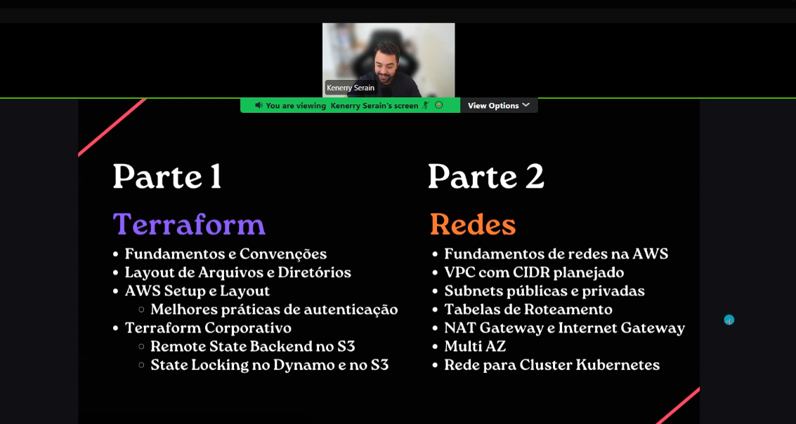
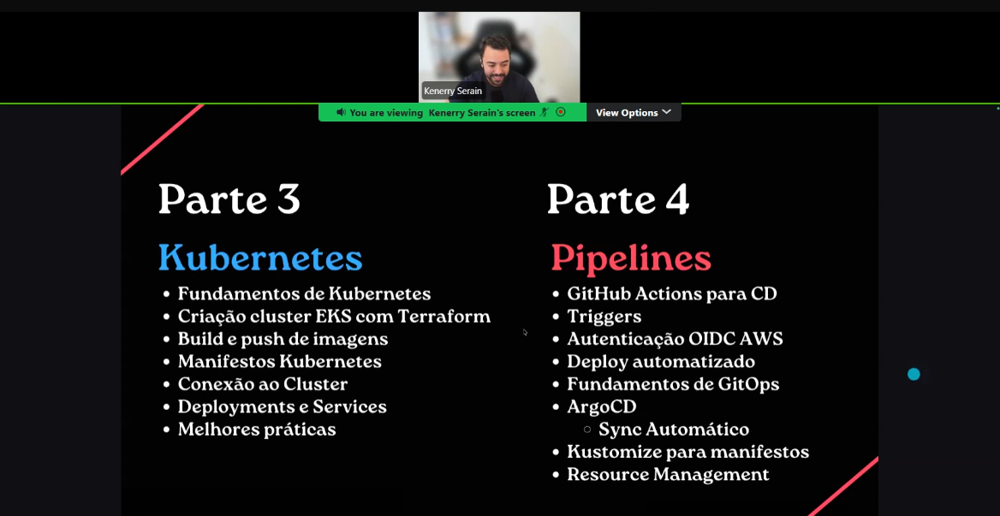
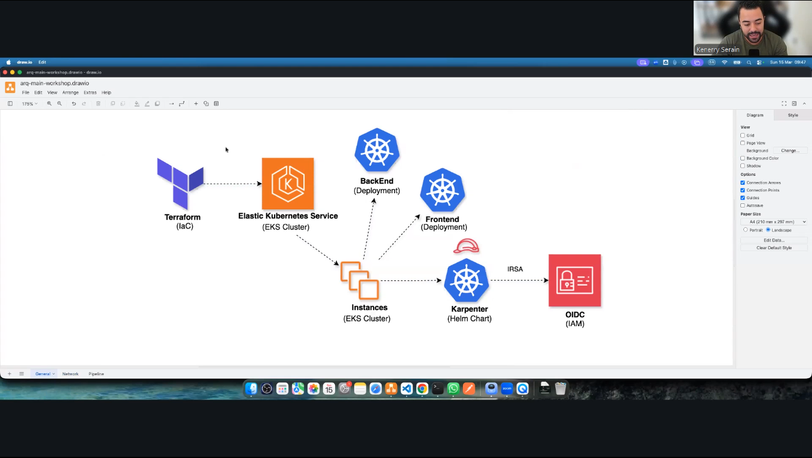
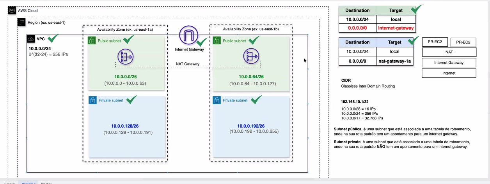
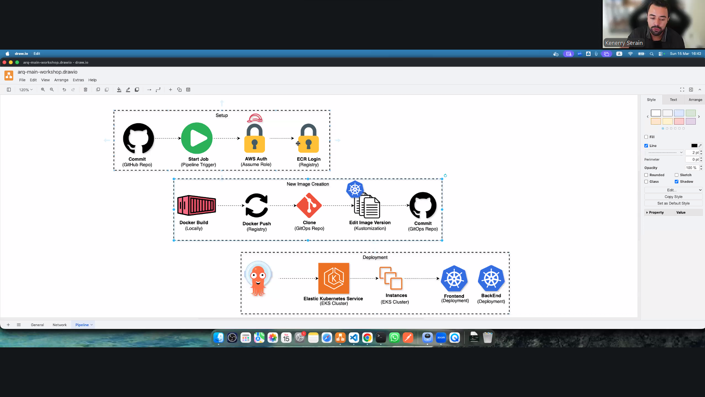

# Workshop DevOps na Nuvem

Documentacao simples para subir a infraestrutura e rodar as aplicacoes deste projeto.

## Objetivo do workshop

Este projeto foi desenhado para ser executado em ambiente real na AWS, entregando uma experiencia pratica de como funciona um ambiente de producao em cloud provider.

O fluxo principal contempla:

- Provisionamento de infraestrutura real com Terraform
- Cluster Kubernetes real com EKS
- Registro de imagens real com ECR
- Pipeline de deploy real com GitHub Actions + GitOps

## Visao Geral

### Cronograma do workshop




### Arquitetura principal



### Topologia de rede (VPC)



### Fluxo de pipeline



## Estrutura do repositorio

- `00-remote-backend/`: cria backend remoto do Terraform (S3 + DynamoDB lock)
- `01-networking/`: cria VPC, subnets, route tables, Internet Gateway e NAT Gateway
- `02-eks-cluster/`: cria EKS, Node Group, ECR e IAM/OIDC para GitHub Actions
- `dvn-workshop-apps/`: codigo das aplicacoes backend (.NET) e frontend (Next.js)
- `scripts/`: scripts auxiliares

## Pre-requisitos

- AWS CLI configurado com credenciais validas
- Terraform 1.x
- kubectl
- Docker
- Node.js 21+ e npm
- .NET SDK 8

## Antes de rodar

Este projeto usa `assume_role` no provider AWS. Ajuste os valores para sua conta.

### 1) Defina Role ARN e regiao

Ajuste o valor de `assume_role.arn` (e, se necessario, `region`) nestes arquivos:

- `00-remote-backend/variables.tf`
- `01-networking/variables.tf`
- `02-eks-cluster/variables.tf`

### 2) Defina o bucket do backend remoto

No modulo `00-remote-backend`, ajuste em `remote_backend.s3_bucket_name` dentro de:

- `00-remote-backend/variables.tf`

Depois, use o mesmo bucket no backend dos modulos abaixo:

- `01-networking/main.tf` -> campo `backend "s3" { bucket = "..." }`
- `02-eks-cluster/main.tf` -> campo `backend "s3" { bucket = "..." }`

## Subindo a infraestrutura (ordem correta)

Execute os modulos na sequencia abaixo.

### Etapa 1: Backend remoto do Terraform

```bash
cd 00-remote-backend
terraform init
terraform plan
terraform apply
```

### Etapa 2: Rede (VPC)

```bash
cd ../01-networking
terraform init
terraform plan
terraform apply
```

### Etapa 3: Cluster EKS + ECR + IAM/OIDC

```bash
cd ../02-eks-cluster
terraform init
terraform plan
terraform apply
```

## Conectando no cluster EKS

Apos o apply da etapa 3:

```bash
aws eks update-kubeconfig --region us-east-1 --name workshop-march-eks-cluster
kubectl get nodes
```

Se os nodes aparecerem como `Ready`, o cluster esta operacional.

## Execucao local (opcional)

Observacao: a execucao local e apenas para desenvolvimento e validacao rapida. A experiencia oficial do workshop acontece no ambiente AWS provisionado.

### Backend (.NET)

```bash
cd dvn-workshop-apps/backend/YoutubeLiveApp
dotnet restore
ASPNETCORE_URLS=http://localhost:8080 dotnet run
```

Acesse:

- Swagger: http://localhost:8080/backend/swagger
- Health: http://localhost:8080/backend/health

### Frontend (Next.js)

```bash
cd dvn-workshop-apps/frontend/youtube-live-app
npm ci
npm run dev
```

Acesse:

- http://localhost:3000

## Pipeline e Deploy

O workflow em `.github/workflows/continuos-deployment.yml` faz:

- Build e push das imagens backend/frontend para o ECR
- Atualizacao da tag de imagem no repositorio GitOps
- Deploy automatizado no cluster via fluxo GitOps

Trigger padrao:

- Push na branch `main`
- Execucao manual via `workflow_dispatch`

## Comandos uteis

```bash
# Ver estado dos recursos Kubernetes
kubectl get all -A

# Ver imagens no ECR
aws ecr describe-repositories --region us-east-1

# Validar configuracao Terraform
terraform validate
```

## Troubleshooting rapido

- Erro de acesso AWS/role: valide seu `assume_role.arn` e permissoes de trust policy.
- Erro de backend Terraform: confirme se o bucket existe e esta igual em todos os modulos.
- EKS sem nodes: confira Node Group, subnets privadas e rotas de saida (NAT).
- Pipeline sem push no GitOps repo: valide o secret `PAT` no GitHub.

## Observacao de custo

Este projeto cria recursos cobraveis na AWS (EKS, EC2, NAT Gateway, ECR, etc.).
Ao finalizar os testes, destrua os ambientes para evitar custos desnecessarios.

Sugestao de teardown (ordem inversa):

1. `02-eks-cluster` -> `terraform destroy`
2. `01-networking` -> `terraform destroy`
3. `00-remote-backend` -> `terraform destroy`
